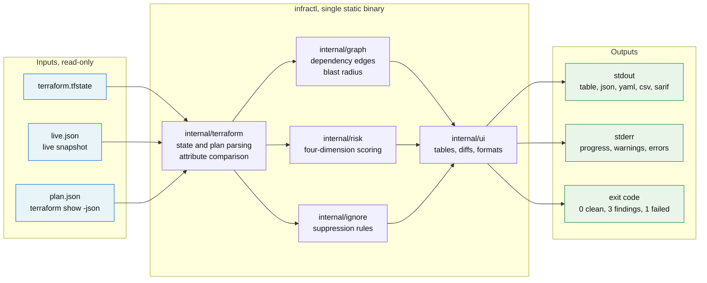
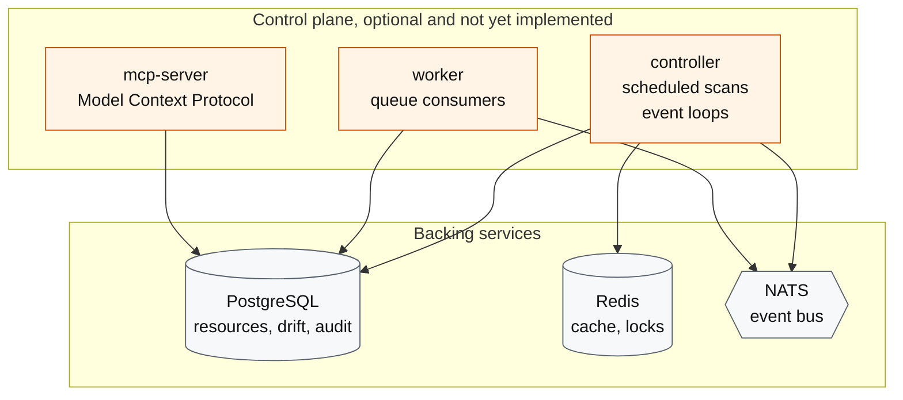

<div align="center">

# infra-control

**Read your Terraform state. Compare it to reality. Know what broke, what it costs you, and what it takes down with it.**

[](https://go.dev)
[](https://www.terraform.io)
[](https://opentofu.org)
[](LICENSE)
[](https://github.com/Ashutosh0x/infra-control/actions/workflows/ci.yml)
[](https://goreportcard.com/report/github.com/ashutosh0x/infra-control)

[Install](#installation) · [Quick start](#quick-start) · [Features](#features) · [Commands](#command-reference) · [CI](#continuous-integration) · [Docs](docs/) · [Discussions](https://github.com/Ashutosh0x/infra-control/discussions)

</div>

---

## What this is

`infractl` answers four questions about infrastructure you already manage with Terraform or OpenTofu:

| Question | Command | Needs |
| --- | --- | --- |
| What is Terraform actually managing? | `infractl state inspect` | A state file |
| Has anything changed behind Terraform's back? | `infractl drift scan` | A state file and a live snapshot |
| If I apply this plan, what does it destroy? | `infractl plan analyse` | A JSON plan |
| Which resources are risky, and why? | `infractl risk assess` | A state file |
| If I change this, what else breaks? | `infractl graph blast-radius` | A state file |

All of it runs locally. No server, no agent, no cloud credentials, no data leaving the machine.

### Why another one

[driftctl](https://github.com/snyk/driftctl), the tool most teams reached for, has been in maintenance mode since Snyk stopped feature work on it. The alternatives that kept moving are SaaS control planes: Firefly, Spacelift, env0, Scalr. They are good products, and they all want your state file on their servers and a seat-based contract.

This sits in the gap: a single static binary that reads the files you already have, exits with a status code CI can branch on, and prints the same data as a table for a human or JSON for a pipeline.

---

## Installation

### Package managers

```bash
# Homebrew (macOS, Linux)
brew install Ashutosh0x/tap/infractl

# Scoop (Windows)
scoop bucket add ashutosh0x https://github.com/Ashutosh0x/scoop-bucket
scoop install infractl

# Go
go install github.com/ashutosh0x/infra-control/cmd/infractl@latest
```

### Docker

The image is distroless and runs as a non-root user, so a mounted working
directory cannot be modified by the container.

```bash
docker run --rm -v "$PWD:/work" ghcr.io/ashutosh0x/infractl:latest   drift scan --state terraform.tfstate --live live.json
```

> The image is published on each release. GitHub creates new packages private
> by default, so make `infractl` public under the repository's Packages
> settings before this command works for anyone else.

### Binary download

Grab a build from [Releases](https://github.com/Ashutosh0x/infra-control/releases). Binaries are static, with no runtime dependency.

```bash
# Linux, amd64
curl -sSL https://github.com/Ashutosh0x/infra-control/releases/latest/download/infra-control_Linux_x86_64.tar.gz \
  | tar xz infractl && sudo mv infractl /usr/local/bin/

# macOS, Apple silicon
curl -sSL https://github.com/Ashutosh0x/infra-control/releases/latest/download/infra-control_Darwin_arm64.tar.gz \
  | tar xz infractl && sudo mv infractl /usr/local/bin/
```

```powershell
# Windows
$url = "https://github.com/Ashutosh0x/infra-control/releases/latest/download/infra-control_Windows_x86_64.zip"
Invoke-WebRequest $url -OutFile infractl.zip
Expand-Archive infractl.zip -DestinationPath "$env:LOCALAPPDATA\Programs\infractl"
$env:Path += ";$env:LOCALAPPDATA\Programs\infractl"
```

### From source

```bash
git clone https://github.com/Ashutosh0x/infra-control.git
cd infra-control
make build          # binaries land in ./bin
```

### Verify

```bash
infractl version
```

### Shell completion

Completion covers subcommands, flags, and the closed-vocabulary flag values such as `--severity` and `--fail-on`.

```bash
infractl completion bash > /etc/bash_completion.d/infractl     # Bash
infractl completion zsh  > "${fpath[1]}/_infractl"             # Zsh
infractl completion fish > ~/.config/fish/completions/infractl.fish
infractl completion powershell | Out-String | Invoke-Expression
```

---

## Quick start

### See it work, with no setup

```bash
infractl demo
```

Runs the whole pipeline against fixtures embedded in the binary. Nothing is read from your machine, nothing leaves it, and it drives the same code a real scan does.

### 1. Capture what is actually live

```bash
infractl snapshot from-plan
```

This runs `terraform plan -refresh-only` and `terraform show -json` for you, then extracts the refreshed attribute values Terraform read back from your providers. It is a live read of your infrastructure, performed by Terraform, using credentials you already have configured. No new permissions, nothing sent anywhere.

> Terraform refreshes only what it manages, so a snapshot built this way can never contain an **unmanaged** resource. For those you need an inventory read — see [docs/live-snapshots.md](docs/live-snapshots.md).

### 2. Find the drift

```bash
infractl drift scan --state terraform.tfstate --live live.json --show-diff
```

```
SEVERITY  KIND             ADDRESS                    TYPE                CHANGES
--------  ---------------  -------------------------  ------------------  -------
CRITICAL  modified         aws_s3_bucket.assets       aws_s3_bucket             2
HIGH      missing in live  aws_db_instance.primary    aws_db_instance
MEDIUM    unmanaged        aws_security_group.orphan  aws_security_group
MEDIUM    modified         aws_subnet.private[1]      aws_subnet                2

aws_s3_bucket.assets [critical]
  - server_side_encryption_configuration.rule = {"sse_algorithm":"AES256"}
  ~ acl "private" -> "public-read"

4 finding(s) across 5 managed resources: 1 critical, 1 high, 2 medium
```

The bucket scores critical because two security-relevant attributes moved at once: encryption was removed and the ACL went public. A tag edit would have scored info.

### 3. Get the commands that fix it

```bash
infractl drift scan --state terraform.tfstate --live live.json --fix
```

Every finding has exactly one of three safe resolutions, determined by its kind, not by judgement:

| Finding | Resolutions offered |
| --- | --- |
| modified | revert with `apply -target`, or accept with `apply -refresh-only -target` |
| missing in live | recreate with `apply -target`, or record the deletion with `-refresh-only` |
| unmanaged | adopt it with a generated `import` block |

Nothing is executed. The tool proposes and prints the blast radius; a person applies. Measuring a risk and then taking it anyway would give up the reason to trust the measurement.

```bash
infractl drift scan ... --emit-import imports.tf   # just the import blocks
```

### If something looks wrong

```bash
infractl doctor
```

Checks the state file, snapshot freshness, ignore-rule expiry, config parsing, and the Terraform binary. Every failure names the command that fixes it.

---

## Features

### Analysis, no server required

| Feature | Command | What it does |
| --- | --- | --- |
| Snapshot capture | `snapshot from-plan` | Build the live snapshot from a Terraform refresh-only plan |
| Remediation output | `drift scan --fix` | Revert/accept commands and import blocks; runs nothing |
| Coverage metric | `drift scan` | How much of the observed estate Terraform actually manages |
| Diagnostics | `doctor` | Validates inputs and names the fix for each failure |
| Zero-setup demo | `demo` | Full pipeline against embedded fixtures |
| State inspection | `state inspect` | Format version, serial, lineage, provider and type breakdown |
| Resource listing | `state list` | Every managed instance, filterable by type, provider, module |
| Attribute view | `state show` | Full attributes for one resource, secrets masked |
| Drift detection | `drift scan` | Modified, deleted, and unmanaged resources with property-level diffs |
| Plan analysis | `plan analyse` | Create/update/delete/replace counts, destructive-change isolation |
| Risk scoring | `risk assess` | Security, reliability, cost, and compliance scored and weighted |
| Blast radius | `graph blast-radius` | Everything that breaks when a resource changes, by distance |
| Dependency listing | `graph deps` | Upstream or downstream neighbours of a resource |
| Graph export | `graph export` | Graphviz DOT or Mermaid, renderable inline on GitHub |
| Drift suppression | `.infractl-ignore.yaml` | Silence expected drift with a required reason and optional expiry |
| GitHub code scanning | `-o sarif` | Findings in the Security tab, annotated on the pull request |

### Correctness details that matter

| Behaviour | Why it exists |
| --- | --- |
| Data sources excluded from drift | Terraform reads them but does not own them; flagging them makes every upstream change look like an unauthorised edit |
| Provider bookkeeping ignored (`id`, `arn`, `tags_all`, `etag`, timestamps) | These never round-trip from a live read; comparing them reports drift on every resource every run |
| `int64(3)` equals `float64(3)` | State decodes with `UseNumber`, live reads often yield floats; a naive comparison flags every numeric attribute |
| Integers past 2^53 keep their precision | Account and snapshot IDs exceed it, and a corrupted ID shows up as permanent phantom drift |
| Replace counted once, as destructive | Terraform encodes it as delete plus create; counting two changes understates that a live resource is going away |
| Encryption checks skip resource types without encryption | A VPC has no encryption setting; a finding nobody can act on teaches users to ignore the tool |
| Single-AZ checks skip subnets | A subnet is single-AZ by definition |
| Live-only attributes are not drift | Cloud APIs return many server-assigned fields Terraform never tracks |
| Sensitive values dropped before output | Masking at render time would still leak them through `-o json` |
| Output sorted deterministically | Two runs over unchanged input produce byte-identical output, so CI can diff or checksum it |

### Terminal experience

| Behaviour | Detail |
| --- | --- |
| Results on stdout, progress on stderr | `infractl ... -o json \| jq` works with no filtering |
| Colour auto-detection | Honours [`NO_COLOR`](https://no-color.org), `FORCE_COLOR`, `TERM=dumb`, `--color`, and TTY detection |
| Machine output is never styled | `-o json` strips ANSI regardless of colour flags |
| Width-aware tables | Columns size to content, then shrink only truncatable columns to fit; identifiers stay whole |
| ANSI-correct alignment | Column widths measure display width, not byte length, so styled cells stay aligned |
| ASCII fallback | `--ascii`, or automatic on a non-UTF-8 console, swaps box-drawing for ASCII |
| Windows VT enabled | Console mode is switched so escapes render instead of printing literally |
| Spinners degrade | Animation on a TTY; one line at start on a pipe, so CI logs stay readable |
| No emoji anywhere | Status is carried by words, colour, and box-drawing, all of which survive a mono terminal and a screen reader |

### Output formats

| Format | Flag | Use |
| --- | --- | --- |
| Table | `-o table` (default) | Reading in a terminal |
| Wide | `-o wide` | Extra columns |
| JSON | `-o json` | Pipelines, `jq` |
| YAML | `-o yaml` | Config-adjacent tooling |
| CSV / TSV | `-o csv`, `-o tsv` | Spreadsheets |
| Name | `-o name` | Shell loops: `for a in $(infractl state list x -o name)` |
| SARIF | `-o sarif` | GitHub code scanning, Security tab alerts |
| Template | `-o go-template='{{.Address}}'` | Custom shaping |

---

### Configuration

A team running this in CI ends up repeating the same flags on every invocation. `.infractl.yaml` holds them instead, so the settings are reviewed like the code is and a pipeline definition stays short enough to read.

```yaml
# .infractl.yaml
state: terraform.tfstate
live: live.json
min-severity: medium

profiles:
  production:
    min-severity: high
    fail-on: high
  audit:
    min-severity: info
    output: json
```

```bash
infractl drift scan                        # uses the file
infractl drift scan --profile production   # applies the production block
```

Precedence, highest first:

| Source | Example |
| --- | --- |
| Command-line flag | `--min-severity critical` |
| Environment variable | `INFRACTL_MIN_SEVERITY=critical` |
| Config file | `min-severity: high` |
| Flag default | `info` |

The search path is `--config`, then `./.infractl.yaml`, then `$HOME/.infractl.yaml`, then `$HOME/.config/infractl/`. A missing file is not an error; a file that exists but does not parse is, because it was clearly meant to be used.

### Pre-commit

```yaml
# .pre-commit-config.yaml
repos:
  - repo: https://github.com/Ashutosh0x/infra-control
    rev: v0.2.0
    hooks:
      - id: infractl-plan          # reject destructive plans
      - id: infractl-state-check   # catch truncated or half-written state
```

### Suppressing expected drift

Some infrastructure drifts by design: an autoscaling group's capacity moves on its own, a provider assigns a load balancer's IP, a resource mid-decommission disagrees with state until it is removed. Reporting these every run is the failure mode that gets drift tooling switched off, because the real findings get lost among the ones nobody can act on.

`.infractl-ignore.yaml` suppresses them:

```yaml
version: 1
rules:
  - address: "aws_autoscaling_group.*"
    attributes: [desired_capacity, min_size]
    reason: "Capacity is managed by the autoscaling policy, not Terraform"

  - address: "aws_instance.bastion"
    reason: "Decommissioning, tracked in INFRA-4821"
    expires: "2026-12-31"
```

Three rules keep this from becoming a way to hide problems:

| Property | Effect |
| --- | --- |
| A reason is required | A rule without one is a config error, not a silent default, so the file stays reviewable |
| Expiry is enforced | Past the date the rule stops suppressing and the scan says so, which stops a temporary exception becoming permanent |
| Suppression is counted | Every scan reports how many findings were hidden and which rule hid each; `--no-ignore` shows them |

An attribute-scoped rule suppresses a finding only if it covers **every** changed attribute. A resource where an expected attribute and an unexpected one both moved is still reported, because the unexpected one is the finding.

```bash
infractl drift scan --state terraform.tfstate --live live.json            # nearest ignore file
infractl drift scan --state terraform.tfstate --live live.json --no-ignore # audit what is hidden
```

### GitHub code scanning

`-o sarif` emits SARIF 2.1.0, so drift lands in the repository's Security tab next to CodeQL, annotated on the pull request that introduced it, with GitHub tracking which findings are new, fixed, or still open across runs.

```yaml
      - name: Drift scan
        run: |
          infractl drift scan --state terraform.tfstate --live live.json             -o sarif > drift.sarif
        continue-on-error: true

      - uses: github/codeql-action/upload-sarif@v3
        with:
          sarif_file: drift.sarif
          category: infractl-drift
```

A clean scan still uploads a valid document with zero results, which is how GitHub learns the previous findings are fixed rather than merely absent.

## Command reference

```
infractl
├── state
│   ├── inspect <file>              Summarise a state file
│   ├── list <file>                 List managed resources
│   └── show <file> <address>       Show one resource's attributes
├── drift
│   └── scan                        Compare state against a live snapshot
├── plan
│   └── analyse <plan.json>         Report what a plan changes and destroys
├── risk
│   └── assess                      Score resources across four dimensions
├── graph
│   ├── stats                       Node and edge counts
│   ├── blast-radius <address>      What breaks if this changes
│   ├── deps <address>              What this depends on
│   └── export                      DOT or Mermaid
└── version                         Version, commit, build info
```

Commands for the hosted control plane (`discover`, `policy`, `compliance`, `cost`, `security`, `remediate`, `audit`) have no implementation and are **excluded from default builds**, so `--help` lists only what the tool can actually do. Build with `-tags preview` to see them; they return an explicit error rather than a placeholder result. See [Project status](#project-status).

### Global flags

| Flag | Default | Purpose |
| --- | --- | --- |
| `-o, --output` | `table` | Output format |
| `-q, --quiet` | off | Suppress progress; results and errors still print |
| `-v, --verbose` | off | Diagnostic logging on stderr |
| `--color` | `auto` | `auto`, `always`, `never` |
| `--no-color` | off | Shorthand for `--color=never` |
| `--ascii` | off | ASCII symbols instead of box-drawing |
| `--config` | | Config file path |

---

## Continuous integration

Exit codes separate "the command failed" from "the command worked and found something":

| Code | Meaning |
| --- | --- |
| `0` | Success, nothing found |
| `1` | The command failed |
| `2` | Invalid arguments or flags |
| `3` | Success, but findings exceeded the threshold |
| `4` | Required configuration or credentials missing |
| `5` | A required backend was unreachable |

### GitHub Actions

```yaml
name: infrastructure
on: [pull_request]

jobs:
  drift:
    runs-on: ubuntu-latest
    steps:
      - uses: actions/checkout@v4
      - uses: actions/setup-go@v5
        with: { go-version: '1.25' }
      - run: go install github.com/ashutosh0x/infra-control/cmd/infractl@latest

      - name: Reject plans that destroy anything
        run: |
          terraform plan -out=tfplan
          terraform show -json tfplan > plan.json
          infractl plan analyse plan.json --fail-on destructive

      - name: Fail on high-severity drift
        run: infractl drift scan --state terraform.tfstate --live live.json --fail-on high
```

Because exit 3 is distinct from exit 1, a job can treat findings and failures differently:

```bash
infractl drift scan --state terraform.tfstate --live live.json --fail-on high -o json > drift.json
case $? in
  0) echo "clean" ;;
  3) gh pr comment "$PR" --body-file <(jq -r '.findings[] | "- \(.severity): \(.address)"' drift.json) ;;
  *) echo "scan failed" >&2; exit 1 ;;
esac
```

More recipes in [docs/ci-integration.md](docs/ci-integration.md).

---

## Tech stack

| Layer | Technology |
| --- | --- |
| Language | [](https://go.dev) |
| CLI | [](https://cobra.dev) [](https://github.com/spf13/viper) |
| IaC | [](https://terraform.io) [](https://opentofu.org) |
| Storage | [](https://postgresql.org) [](https://redis.io) |
| Messaging | [](https://nats.io) |
| Observability | [](https://opentelemetry.io) [](https://prometheus.io) [](https://github.com/uber-go/zap) |
| Transport | [](https://grpc.io) |
| Packaging | [](https://docker.com) [](https://goreleaser.com) |
| CI | [](https://github.com/features/actions) [](https://golangci-lint.run) |

The CLI itself depends on Cobra, Viper, `golang.org/x/term`, and the standard library. Postgres, Redis, NATS, and gRPC belong to the server components and are not linked into local analysis paths.

---

## Architecture



Local analysis touches no network and no server component. The optional hosted control plane is separate:



These are skeletons. See [Project status](#project-status). Details in [docs/architecture.md](docs/architecture.md).

---

## Project status

Honest accounting of what works.

| Area | Status |
| --- | --- |
| State parsing, drift detection, plan analysis, risk scoring, graph | Implemented and tested |
| Terminal UI, output formats, exit codes | Implemented and tested |
| Cloud provider discovery (live API reads) | Not implemented; drift takes a snapshot file instead |
| Policy engine (OPA/Rego), compliance, cost, remediation | Data model and CLI surface exist; no working backend |
| Control-plane server, controller, worker, MCP | Skeletons |

Commands without a working implementation return an error saying so. They never print a placeholder result, because a placeholder is indistinguishable from a real answer to whoever reads the output — and infrastructure decisions get made on that output.

---

## Contributing

Issues and pull requests are welcome. See [CONTRIBUTING.md](CONTRIBUTING.md) for the development setup, and [Discussions](https://github.com/Ashutosh0x/infra-control/discussions) for questions and design proposals.

```bash
make build      # compile
make test       # run tests
make lint       # golangci-lint
make check      # all of the above
```

## Security

To report a vulnerability, follow [SECURITY.md](SECURITY.md). Please do not open a public issue for security reports.

## License

[Apache 2.0](LICENSE).
